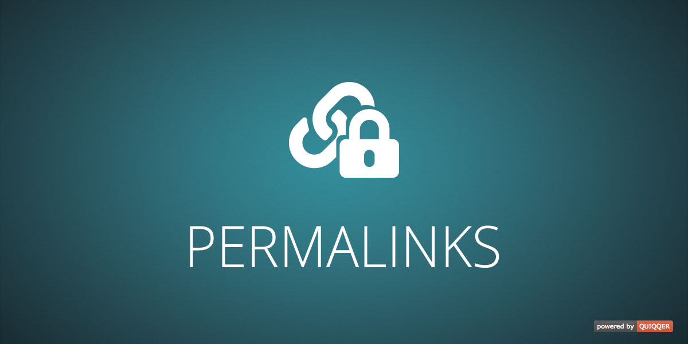

========

Create permalinks for your project sites.

Paketname:

    quiqqer/permalinks

Features
--------

- Allows the creation of permalinks for project sites
- Prevents duplicate permalinks 

Installation
------------

The package name is: quiqqer/permalinks

Usage
-----

1. Open a project site in the backend
2. Select the `Settings` tab
3. Open the `Permalink` section
4. Set or delete the site's permalink

Contribute
----------

- Project: https://dev.quiqqer.com/quiqqer/package-permalinks
- Issue Tracker: https://dev.quiqqer.com/quiqqer/package-permalinks/issues
- Source Code: https://dev.quiqqer.com/quiqqer/package-permalinks/tree/master

Support
-------

If you have found errors, wishes or suggestions for improvement,
you can contact us by email at [support@pcsg.de](mailto:support@pcsg.de).

We will try to meet your needs or send them to the responsible developers
of the project.

Lizenz
-------

- GPL-3.0+